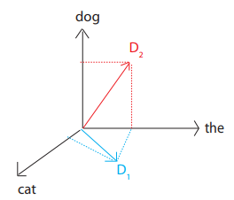

# Document Distance Problem
Given two documents *d1*, *d2* compute the **distance** between them.
* Distance = how **different** the documents are
* Document = sequence of words
* Word = string of alphanumeric chars

## Shard words/chars
* Represent document as a **vector**
    * D1 = "the cat", D2 = "the dog":
    * 

* D[w] = # occurrences of w in D
* Use **angle between the vectors**:
    * arccos(D1&middot;D2 / |D1||D2|)
        * Dot products divided by lengths of documents to make more scale invariant
### Basic Algorithm
1. Split document into words
2. Compute word frequencies
3. Compute dot product (then divide, take arccos)
