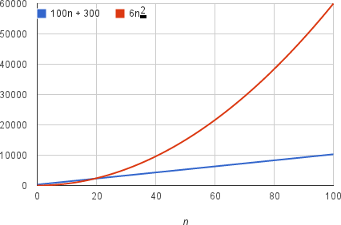

# Asymptotic Notation
* Actual running time depends on the speed of the computer the algorithm is running on.
    * Faster on brand new machine than 10 year old laptop.
* Compare running times using **rate of growth** with respect to input size.
    * Running times is a *function of the size of its input* 

## Example
Simplify the function for an algorithm's running time to extract the *most important* part of it. 

An algorithm, of input size *n* takes *6n2 + 100n + 300* machine instructions to run -> the **function** for its running time.
* The *6n2* term becomes much larger than the other terms once *n* becomes large enough.

    

This algorithm **grows as *n2***. The coefficients (6) and other terms (*100n + 300*) are dropped as they are insignificant compared to the *n2* term.
* As long as running time = *an2 + bn + c*, for some numbers *a > 0, b, and c*, there will **always** be a value of *n* for which *an2* is greater than *bn+c*.
    * This difference increases as *n* increases.

By dropping the less significant terms, the important **rate of growth** can be focused on. Doing so is call **asymptotic notation**, of which there are **three** types:
* Big-Θ notation
* Big-O notation
* Big-Ω notation