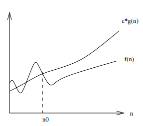

# Big-O Notation
**Worst-case** run time - the greatest running time an algorithm can take.
* *f(n) = O(g(n)) means that there is an *upper* bound on f(n)
* *c &middot; g(n)* = upper bound on f(n)
* There is exists some constant *c* such that *f(n)* is **always** <= *c &middot; g(n)* for large enough *n*
    * *n >= n0* for some constant *n0*.
    * *n0* is the minimum value of *n* for which the relationship holds (dotted line on graph below).

Big-O notation gives **asymptotic upper bounds**, since it bounds the growth of running time **from above** for large enough input sizes.

Can characterise running time in **all cases**. For example, the running time of binary search is **always** *O(logn)*.