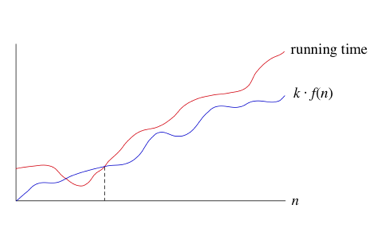

# Big-&Omega; Notation 
**Minimum** running time for an algorithm without an upper bound - it takes *at least* a certain amount of time.
* *f(n) = &Omega;(g(n))* means there is a *lower bound* on f(n)
* *c &middot; g(n)* = lower bound on *f(n)*
* There exists a constant *c* such that *f(n)* is **always** *>= c &middot; g(n)*, for all *n >= n0*.    

Big-&Omega; gives **asymptotic lower bounds**, since it bounds the growth of the running time *from below* for large enough input sizes.