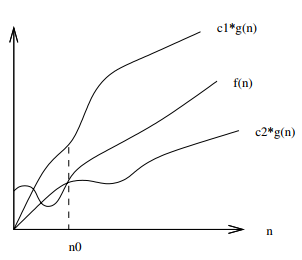

# Big-&Theta; Notation
*f(n) = &Theta;(g(n))* means that there is an upper and lower bound on *f(n)* for all *n >= n0*.
* *c1 &middot; g(n)* = lower bound on f(n)
* *c2 &middot; g(n)* = upper bound on f(n)
* There exists constants *c1* and *c2* such that *f(n) <=c1 &middot; g(n)* and *f(n) >= c2 &middot; g(n)*
* *g(n)* therefore gives a **tight bound** on f(n).

    

Once *n* gets large enough (above dotted line on graph above) the running time is **between** *c1 &middot; g(n)* and *c2 &middot; g(n)*.

Big-&Theta; notation gives an **asymptotically tight bound** on the running time.
* Asymptotic as only matters for large *n* values.
* Tight bound as the running time is within a constant factor above and below.

Big-&Theta; *automatically* implies both Big-O and Big-&Omega;.
    * Big-O -> upper bound
    * Big-&Omega; -> Lower bound