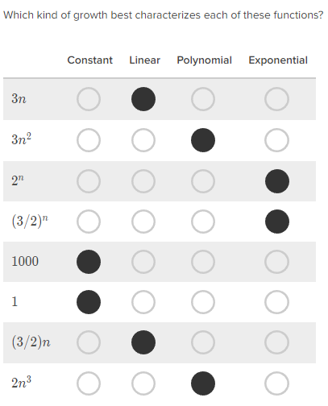
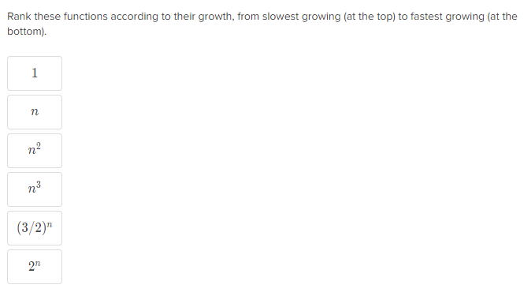
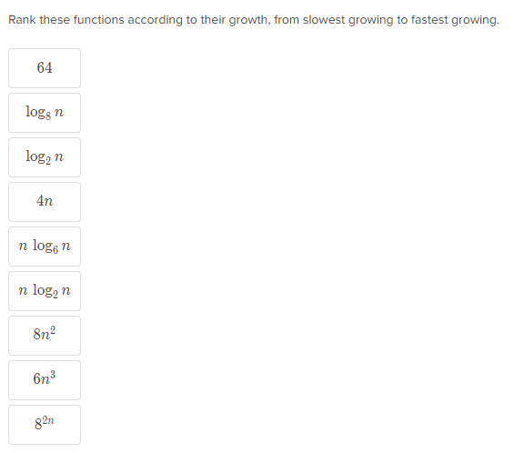
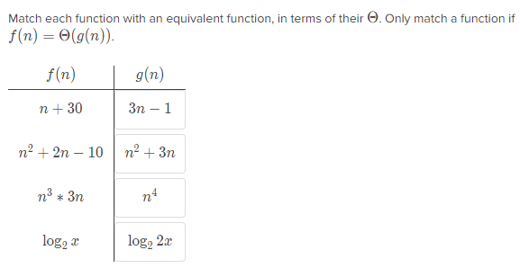

# Comparing Function Growth
In order from slowest growing to fastest growing:
* Constant -> 1
* Logarithmic -> *logn* 
* Linearithmic -> *n &middot; logn*
* Polynomial -> *n2*, *n3* etc
* Exponential -> *2n*
* Factorial -> *n!*

