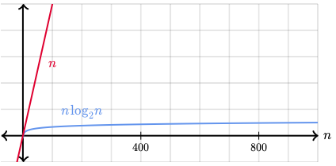

# Binary Search
* Efficient algorithm for finding an item in an **ordered list**.
* Repeatedly halving the portion of the list which *could* contain the item.
    * Discard the portion that's too high/low
* **O(log *n*)** time
    * Compared to O(n) of simple/linear search

    

## Basic Algorithm
```
1. Let min = 1 and max = n.
2. Guess the average of max and min, rounded down to be an integer.
3. If you guessed the number - stop.
4. If too low, set min to be *one larger* than the guess.
5. If too high, set max to be *one smaller* than the guess.
6. Go back to step 2.
```
If item is not present in array, must return a value which **can't be an index** of an array. In some languages (such as Javascript), this is *-1*, however -1 can be an index in Python. So return None instead
## Pseudocode
```
1. Let min = 0 and max = n-1
2. If max < min, stop. Target is not in array. Return None.
3. Compute guess as the average of max and min, rounded down (to be int) -> array index.
4. If array[guess] == target, stop. Return guess.
5. If array[guess] < target, set min = guess + 1.
6. If array[guess] > target, set max = guess - 1.
7. Go back to step 2.
```
## Implementation
### Python
```Python
def binary_search(array, targetValue):
    min = 0
    max = len(array) -1
    while (max >= min):
        mid = int((min + max) / 2)
        guess = array[mid]
        if guess == item:
            return mid
        if guess < item:
            min = mid + 1
        else:
            max = mid - 1
    return None
```
### JavaScript
```Javascript
var binarySearch = function (array, targetValue) {
    var min = 0;
    var max = array.length - 1;
    var guess;
    while (max >= min) {
        guess = Math.floor((max + min) / 2);
        if (array[guess] === targetValue) {
            return guess;
        }
        if (array[guess] < targetValue) {
            min = guess + 1;
        } else {
            max = guess - 1;
        }
    }
    return -1;
};
```

## Exercises (khanacademy)
1. 32 teams qualified for the 2014 World Cup. If the names of the teams were arranged in sorted order (an array), how many items in the array would binary search have to examine to find the location of a particular team in the array, in the worst case?
    * log<sub>2</sub>(32) + 1 = 6
2. You have an array containing the prime numbers from 2 to 311 in sorted order: [2, 3, 5, 7, 11, 13, ..., 307, 311]. There are 64 items in the array. About how many items of the array would binary search have to examine before concluding that 52 is not in the array, and therefore not prime?
    * log<sub>2</sub>(64) + 1 = 7
3. In 2013, there were 193 member states in the United Nations. If the names of these states were sorted alphabetically in an array, about how many names would binary search examine to locate a particular name in the array, in the worst case?
    * No more than 9
4. The 2014 "Catalogue of Life" contains about 1580000 names of species. If these names were sorted in an array, in the worst case, how long would it take to use binary search to find the name of a particular species in the array?
    * log<sub>2</sub>(1580000) + 1 = 22