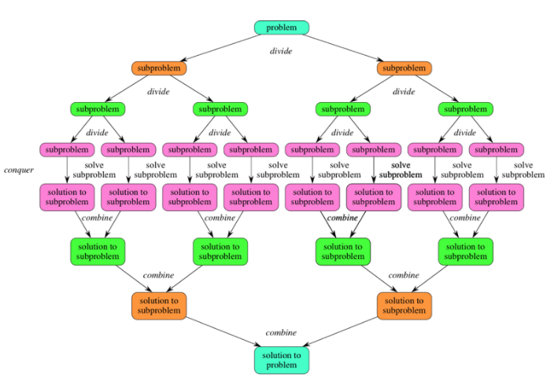

# Divide and Conquer
Algorithmic paradigm based on recursion:
* **Divide** the problem into smaller subproblems that are themselves smaller instances of the same problem.
* **Conquer** the subproblems by solving them recursively.
* **Combine** the solutions to the subproblems into the solution for the original problem.

