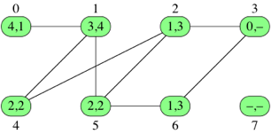

# Breadth-First Search
Computing distances within a graph *layer by layer*. Start from the source node, compute the neighbouring nodes, then move to compute their neighbours (as long as they **haven't already** been processed). Repeat until the target node is found.

Each vertex *v* is assigned:
* **Distance** = minimum number of edges in any path from the source vertex to *v*.
* **Predecessor** = vertex of *v* along some shorted path from the source vertex. Source vertex has a sepcial value (`null`) to show it has no predecessor.

Each vertex has two numbers -  (distance from source, predecessor). A dash represents `null`:



1. Set distance and predecessor of all nodes to `null`
2. Start at source -> assign *d = 0*
3. Assign each neighbour of source *d = 1* and predecessor = source.
4. Assign each neighbour of vertices with *d=1* which **havent already been visited** *d = 2* and set predecessor.
5. Repeat for increasing *d* until *Q* is empty -> visiting all vertices at *d* before visiting any at *d+1* at each step.

All vertices will then have a corresponding *d* and predecessor from the source vertex. The shortes path to a target node can then be found by following the predecessor-chain from the target node back to the source. The target nodes *d* value is the distance of the path.

A *queue* (FIFO) *Q* is used to track progress through the graph.
 * Initially *Q* contains only the source vertex *s*. 

For each subsequent distance *d = 1,2,3...,* from the source, there is a point in time at which *Q* contains all nodes at distance *d* and nothing else. Each node is *dequed* (ejected off the front of the queue) to be processed. As each is processed, their (yet unseen) neighbours are *queued* into the ned of *Q*.

## Implementation
* Create array `vertexInfo` (of objects representing *d* and predecessor for each vertex -> initialising each to null.
* Set distance of `vertexInfo[source]` to 0
* Add source to *Q*
* Traverse graph -> while *Q* not empty:
    * dequeue a vertex *u* 
    * For each neighbour *v* of *u*:
        * Check if has been visited
            * if `vertexInfo[v].distance != null` -> visited
        * If not visited:
            * Set *d* to `u.d + 1`
            * Enqueue  *v*
* return `vertexInfo`
```Javascript
let bfs = function (graph, source) {
    let vertexInfo = [];
    // Index of each object -> vertex number, v
    for (let i = 0; i < graph.length; i++) {
        vertexInfo[i] = {
            // Initialise to null to track which vertices have been processed
            distance: null,
            predecessor: null
        };
    }

    // Source vertex has no predecessor
    vertexInfo[source].distance = 0;

    let queue = new Queue();
    queue.enqueue(source);

    while (!queue.isEmpty()) {
        let u = queue.dequeue();
        // Search through neighbours of u
        for (let i = 0; i < graph[u].length; i++) {
            let v = graph[u][i];
            // Process if not already processed
            if (vertexInfo[v].distance === null) {
                // Update info for u
                vertexInfo[v].distance = vertexInfo[u].distance + 1;
                vertexInfo[v].predecessor = u;
                // Add to queue to process its neighbours later
                queue.enqueue(v);
            }
        }
    }

    return vertexInfo;
};
```

## Analysis - ***O(|V| + |E|0)***
*2|V|* queue operations:
* Each vertex is **put** on the queue *exactly once* (when first encoutnered) and then **removed** from the queue *exactly once* -> *2|V|* queue operations.

*|E|* loops for edge lookup:
* The innermost loop of the algorithm looks at each edge either once (directed graphs) or twice (undirected graphs) taking *O(|E|)* time.

Put together, removing constant terms gives *O(|V| + |E|0)*