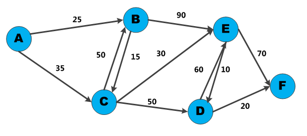

# Dijkstra's Algorithm
Finds the length of an **optimal path** (shortest/quickest/cheapest etc) between two vertices in a weighted (**non-negative**) graph. It creates a tree of the most optimal paths from the starting vertex to all other points in the graph.

The algorithm repeatedly tests all **single edge extensions** of the *currently* **known** region , *R*,optimal paths. The most optimal extended path is then used as the endpoint to be the next node of *R*. This will **grow** *R* by looking at extensions of the current set of optimal paths.


## Implementation
### Data Structures
* `dist` = array of distance from the source node *s* to each node in the graph. Initialised as:
    * `dist(s) = 0`
    * All other nodes *v*, *dist(v) = &infin;*
* `Q` = a queue of all nodes in the graph.
    * Will be empty at end of algorithm
* `S` = **Set** containing the nodes that have been processed.
    * Initialised as &empty;
    * Will contain all nodes of graph at end of algorithm
### Algorithim
1. While *Q* is not empty:
    * Pop the node *v* that is not already in *S* from *Q* with the **smallest** *dist(v)*
2. Add node *v* to *S*
3. Update *dist* values of **adjacent** nodes to the current node *v* - for each new adjacent node *u*:
    * If *dist(v) + weight(u, v) < dist(u)*
        * New minimum distance for *u* found.
        * Update *dist(u)* to new value.
    * Else:
        **No updates** to *dist(u)* are made.

Once loop complete, all nodes in the graph have been processed and the smallest distance to each node from the source *s* has been found. *dist* now contains the **shortest path tree** from source *s*/

### Pseudocode
```Python
function dijkstra(graph, source):
    # Initialising values for dist
    dist[source] = 0
    for each vertex v in graph:
        if v != source:
            dist[v] = infinity
        add v to Q
    
    while Q is not empty:
        v = vertex in Q with min dist[v] # source node on first iteration
        pop v from Q
        add v to S
        for each neighbour u of v: # where neighbour u has not been removed from Q yet
            alt = dist[v] + length(v, u)
            if alt < dist[u]: # shorter path found
                dist[u] = alt # update distance of u
    return dist[]
end function
```

## Basic Implementation (no queue)
### Data Structures
Need 4 data structures:
1. Graph representation
2. Node costs/distances
3. Node parents
    * Finding path at end of algorithm
4. Array to track processed nodes

**N.B:** Data structure implementations below are just examples to give nodes their 'real' names. Can also use arrays with each node numbered *0 to n-1*.



#### Graph
Nested hash tables storing the neighbours *and weights* of each node.
```Python
graph = {"A": {"B": 25, "C": 35},
         "B": {"C": 15, "E": 90},
         "C": {"B": 50, "D": 50, "E": 30},
         "D": {"E": 60, "F": 20},
         "E": {"D": 10, "F": 70},
         "F": {}
         }
```
#### Costs
Hash table representing **current known** cost/distance from the source to each node - initialised to &infin; / `null`/None. Updated as the algorithm progresses
```Python
inf = float("inf")  # python infinity
costs = {"A": 0, "B": 25, "C": 35, "D": inf, "E": inf, "F": inf}
```
#### Parents
Hash table representing **current known** parent of each node - i.e. the preceeding node in the best currently known path from the source to that node.

```Python
parents = {"A": None, "B": "A", "C": "A", "D": None, "E": None, "F": None}
```
#### Processed nodes
Simple array which contains all the nodes which have been processed at any given time. Used to ensure that nodes aren't processed multiple times:
```Python
processed = []
```
#### Algorithm
```
while nodes left to process:
    get node closest to start
    update cost for its neighbours
    if neghbour cost updated:
        udpate parents
    mark node as processed
```

```Python
def dijkstra(graph, costs, parents):
    processed = []
    node = find_lowest_cost_node(costs,processed)
    # stop when all nodes processed
    while node is not None: 
        cost = costs[node]
        neigbours = graph[node]
        for n in neighbours.keys():
            new_cost = cost + neighbours[n]
            if costs[n] > new_cost:
                costs[n] = new_cost
                parents[n] = node
            processed.append(node)
            node = find_lowest_cost_node(costs, processed)
```

```Python
def find_lowest_cost_node(costs, processed):
    lowest_cost = float("inf")
    lowest_cost_node = None
    for node in costs:
        cost = costs[node]
        if cost < lowest_cost_node and is not in processed:
        lowest_cost = cost
        lowest_cost_node = node
    return lowest_cost_node
```