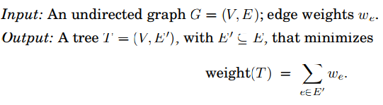
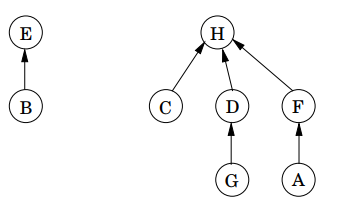
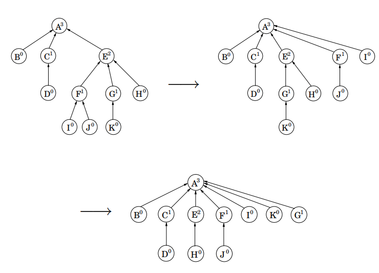
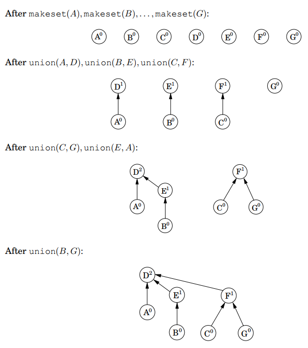

# Kruskals Algorithm
Greedy algorithm for finding minimum spanning trees.

## Minimum Spanning Trees
A tree that spans **all nodes** in a graph with the **minimum total** weight. Formal definition:



## Basic Algorithm
Start with empty graph, repeatedly select edges (that have not yet been selected) according to the rule:
* Repeatedly add the **next lightest** edge that **doesn't produce a cycle**.

Constructs an MST one edge at a time and picks the **locally optimal** (lightest) edge at each step. 
* Other than avoiding cycles, it simply chooses the most advantageous at each step

### Avoiding Cycles
At each step, each candidate edge *(u, v)* must be tested to see whether endpoint *u* and *v* lie in **different components** of the currently built MST.
* If not then a cycle would be formed

If chosen, the corresponding components are **merged**.

## Pseudocode
**Algorithm state** = collection of **disjoint sets**
* Each contains nodes of a component of MST
```Python
def kruskal(G, w):
    # G -> connected, undirected graph G=(V, E)
    # w -> edge weights

    for each vertex:
        makeset(vertex)

    X={} # Current spanning tree
    Sort edges E by increasing order of weight

    for each edge (u, v) in E:
        if find(u) != find(v): # find returns the set u/v belongs to
            add edge (u, v) to X
            union(u, v) # merge sets containing u, v
```
## Union by Rank
**Directed trees** to represent disjoint sets:
* Nodes = elements of set
* Each parent has pointers -> leading to root node
* Root element = **representative** or *name* for the set.
    * Root has self-pointer -> distinguishable
* **Rank** of each node = height of *subtree* **hanging**/rooted at that node.

Sets *{B, E}* and *{A, C, D, F, G, H}*:



`makeset` is used to make a new tree to represent a set with a single element:
* **constant time** = &Theta;(1)
```Python
def makeset(x):
    parent(x) = x
    rank(x) = 0
```
`find` is used to find the representative/root node of an element in a set:
* Follows parent pointers to root node.
```Python
def find(x):
    if x != parent(x):
        parent(x) = find(parent(x))
    return parent(x)
```
* `find` uses **path compression**:
    * Each time `find` follows a series of pointers to the root of a tree, it *changes* the pointers to point **directly at the root**.
    * Improves run time in long term from *O(logn)* to just over *O(1)*.
    
    Path compression - `find(I)` followed by `find(k`):

    

`union` **merges** sets:
* Root node of one set made to point to the root of the other.
* Make root of *smaller* tree **point** to the root of the *taller* tree.
    * Overall height *only increases* if the two trees are equally tall.
    * Running time dependent on *height* of tree.
* *Ranks* of root nodes used to determine height of trees -> **Union by Rank**.

Used to *build* trees:
```Python
def union(x, y):
    root_x = find(x)
    root_y = find(y)

    if root_x = root_y :
        return
    if rank(root_x) > rank(root_y):
        parent(root_y) = root_x
    else:
        parent(root_x) = root_y
        if rank(root_x) = rank(root_y):
            rank(root_y) = rank(root_y) + 1
```
 Superscripts = rank:
 


