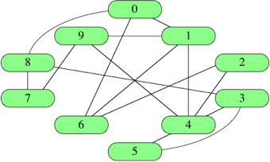

# Representing Graphs
Criteria for representation:
* **Memory** requirement
* Time to determine whether a given **edge is in the graph**
* Time to find the **neighbours** of a given vertex

|*V*| -> number of vertices
|*E*| -> numebr of edges



## Edge Lists
Represent an edge with an array/object of **two vertex numbers** which the edge is *incident* upon and a third value representing the weight if present.
* *E* from 0->6 = `[0, 6]`

Represent all edges as such and store in a list. For graph above:
```
graph = [ [0,1], [0,6], [0,8], [1,4], [1,6], [1,9], [2,4], [2,6], [3,4], [3,5],
[3,8], [4,5], [4,9], [7,8], [7,9] ]
```
**Total space = &Theta;(E)**
* Each edge requires same number of values stored.

**Edge lookup unsorted = &Theta;(E)**
* Must linearly search through edge list.

**Edge lookup sorted = O(log(*E*))**
* Ordered *E<sub>1</sub>* then be *E<sub>2</sub>* a binary search can be done giving **O(log *E*)**

## Adjacency Matrices
|*V*| x |*V*| matrix of **0s and 1s**. Entry in *row i* and *column j* is 1 **iff** the edge *(i, j)* is in the graph.
* Indicate edge **weight** by putting it in the *row i, column j* entry and **reserve a special value** (i.e. null) to indicate an absent edge *instead* of using 0 (0 now represents weight=0)

For graph above:


Represent with **2d array**:
```
graph = [ [0, 1, 0, 0, 0, 0, 1, 0, 1, 0],
        [1, 0, 0, 0, 1, 0, 1, 0, 0, 1],
        [0, 0, 0, 0, 1, 0, 1, 0, 0, 0],
        [0, 0, 0, 0, 1, 1, 0, 0, 1, 0],
        [0, 1, 1, 1, 0, 1, 0, 0, 0, 1],
        [0, 0, 0, 1, 1, 0, 0, 0, 0, 0],
        [1, 1, 1, 0, 0, 0, 0, 0, 0, 0],
        [0, 0, 0, 0, 0, 0, 0, 0, 1, 1],
        [1, 0, 0, 1, 0, 0, 0, 1, 0, 0],
        [0, 1, 0, 0, 1, 0, 0, 1, 0, 0] ]
```
Undirected graph = **symmetric** adjacency matrix:
* *(i, j)* is 1 **iff** *(j, i)* is 1
* Directed graph does not need to be symmetric

**Total space = &Theta;(*V<sup>2</sup>*)**
* When graph is *sparse* most space is just taken up with 0's.

**Finding adjacent vertices** to a given vertex *i* requires looking at all |*V*| entries in row *i* - even if only a small number are adjacent.

**Edge lookup = &Theta;(1)**
* Array lookup `graph[i][j]` to find edge *(i, j)* -> constant time

## Adjacency Lists
Combination of edge lists and adjacency matrices. Store and array of the vertices adjacent to each vertex *i*. Not required to be in any order, but increasing order allows for easy representation using arrays.


If graph is weighted, each item in adjacency list is a two-item array/object containing the vertex *i* and its weight.

Represent with **2d array**, index of outer array corresponds to a vertex *i*:
```
graph = [ [1, 6, 8],
  [0, 4, 6, 9],
  [4, 6],
  [4, 5, 8],
  [1, 2, 3, 5, 9],
  [3, 4],
  [0, 1, 2],
  [8, 9],
  [0, 3, 7],
  [1, 4, 7] ]
```
**Retrieving** a vertex adjacency list = &Theta;(1) -> index into array.

**Edge lookup = &Theta(*d*)**
* For vertex *i*,
* *d* = degree of vertex *i*
* Retrieve *i*'s adjacency list, then search through it (number of elements = *d*)

**Totalpace = &Theta;(*V* + *E*)**
* Undirected = each edge *(i, j)* is present *exactly twice* -> in *i*'s adjacency list and in *j*'s adjacency list.
* Directed = one element per directed edge.