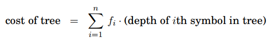

# Huffman Encoding
Used in lossless data compression to encode data into binary. It assigns **variable length** codes to input characters. The length of the code is inversely proportional to the frequency of the character in the input:
* Most frequent character = smallest code
* Least frequent character = largest code

Each code is a **prefix code**:
* No whole code word that is a prefix of **any other** code word in the system.
    * Known as the **prefix-free property**
* Avoids ambiguity in decoding, e.g.
    * codewords = `{A:0,B:01,C:11,D:001}`
    * decoding string `001` is *ambiguous* 
        * Could be `'AB'` or `'D'`

Prefix-free encoding represented by a *full* binary tree.
* Each node has either 0 or 2 children
* Left = 0, right = 1

Makes decoding unique:
* Start at root
* Read string left->right to move down the tree
* Whenever a leaf is reached, output the corresponding symbol and return to root 

Two major parts to Huffman Encoding:
1. Build a Huffman Tree from input characters
2. Traverse the tree and assign codes to characters

## Building Huffman Tree *O(nlogn)*
The tree aims to minimise the **overall length of the encoding**.
For frequencies *f<sub>1</sub>,f<sub>2</sub>,...,f<sub>n</sub>*:



The number of bits required for a symbol is *exactly* its depth in the tree.

The **cost of a tree** is the sum of the frequencies of all leaves and internal nodes, except the root.
* Each time the tree is traversed, one bit gets output for each *non-root* node passed.

The two symbols with the *smallest frequencies* must be at **the bottom** of the optimal tree.
* Will have the **largest** cost, but not visited often

Build tree **greedily**:
* Find symbols with smallest frequencies *i* and *j* and make them the *children* of a new node.
    * New node then has frequency *f<sub>i</sub> + f<sub>j</sub>*
* Pull those symbols off the list of frequencies and repeat
```
1. Create a leaf node for each unique character and build a priority queue ordered by frequency of all leaf nodes

2. Pop two nodes with minimum frequency off the queue

3. Create a new internal node with frequency = sum of the two nodes. Make the first node its left child and the other its right child

4. Add new node to priority queue

5. Repeat steps #2 and #2 until queue contains only one node

6. Set remaining node as the root node -> tree is complete
```
```Python
def huffman(f):
    #f = array of frequencies [1...n]
    H = priority queue of ints, ordered by f
    for i = 1 to n:
        insert(H, i)
    for k = n + 1 to 2n-1:
        i = deletemin(H), j = deletemin(H)
        create a node numbered k w/ children i,j
        f[k] = f[i] + f[j]
        insert (H,k)
```