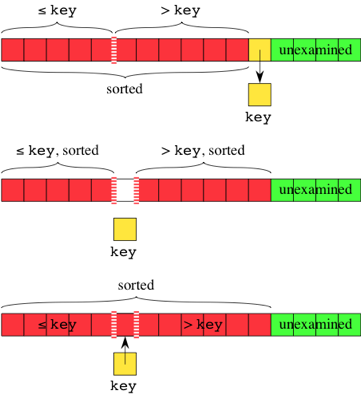

# Insertion Sort
Builds the final sorted array **one item at a time**. Building a subarray which itself *ay any point* in the algorithm is sorted.

The *sorted subarray* start from index 0 - only one item in the array therefore it is sorted. Each item in the unsorted portion is then inserted **in turn** into the correct position within the sorted sub array.

```
Step 1 − If it is the first element, it is already sorted. return 1;
Step 2 − Pick next element
Step 3 − Compare with all elements in the sorted sub-list
Step 4 − Shift all the elements in the sorted sub-list that is greater than the 
         value to be sorted
Step 5 − Insert the value
Step 6 − Repeat until list is sorted
```
### Pseudocode
```
i = 1
while i < length(A)
    j = i
    while j > 0 and A[j-1] > A[j]
        swap A[j] and A[j-1]
        j -= 1
    end while
i += 1
end while
```

## Inserting into Sorted Subarray
A space for the current value (*key*) must be made in the sorted subarray at which to insert it. 

Go through the subarray to the left of *key*'s initial position - right to left. Each element in the subarray that is **greater** than *key* slides one position to the right. Once an element is found that is **<=** to *key*, the sliding of elements stops and **copy** *key* into the "vacated" postion to the right of this element.



```Javascript
let insert = function(array, rightIndex, value) {
    for (let i = rightIndex; i >=0 && array[i] > value ;i--){
        array[i+1] = array[i];
    }
    array[i+1]=value;
};

```

## Implementation
1. Call `insert` function to insert element at index 1 into sorted subarray in index 0.
2. Call `insert` function to insert the element that start at index 2 into the sorted subarray in indecises 0 -> 1
3. Repeat until call `insert` function with element `n-`n into sorted subarray in indeces `0 -> n-2`
```Javascript
let insertionSort = function(array) {
    for(let i = 1; i < array.length; i++){
        insert(array, i-1, array[i]);
    }
};

```
## Analysis
Insertion sort loops over the indices of an array (like selection sort).

If the value to be inserted into the subarray is *less* than all the elements currently in it. Insertion sort must go through **all** the elements of the subarray.
* Subarray with *k* elements
* Constant number of instructions - *c*
Total time inserting into sorted subarray: 
```
c⋅1+c⋅2+c⋅3+⋯c⋅(n−1)=c⋅(1+2+3+⋯+
```
Arithmetic series gives:

**c⋅(n−1+1)((n−1)/2)=cn
​2
​​ /2−cn/2**

Using asymptotic notation, the lower order terms and constant factors are discarded giving a running time of **&Theta;(n<sup>2</sup>)**.

However, it can take only **&Theta;(n)** if each element is greater than or equal to than the element to its left.
* The array is *already* sorted -> **best case**
If the array is *almost sorted*, each element is at most some constant number , *p*, of positions away from where it should be. 
* The running time is given by *p &middot; c &middot; (n-1)*
* **&Theta;(n)** 
* Fast for an almost sorted array

### Running Times Summary
* Worst case: **&Theta;(n<sup>2</sup>)**
* Best case : **&Theta;(n)** 
* Average case for random array: **&Theta;(n<sup>2</sup>)**
* *Almost sorted* case: **&Theta;(n)** 

In **all cases** insertion sort runs in **O(n<sup>2</sup>)** time.
* Cannot say that it runs in **&Theta;(n<sup>2</sup>)** time in all cases, since the best case runs in **&Theta;(n)** time. 
* Cannot say that it runs in **&Theta;(n)** time in all cases, since the worst-case running time is **&Theta;(n<sup>2</sup>)**.