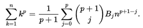
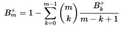

# Bernoulli Numbers
Sequence of rational numbers occuring frequently in number theory.
* Denoted *B<sub>n</sub>*
* For example, used in Faulhabers Formula for the sum of the *p*-th powers of the first *n* positive integers:
    * 

## Recursive Definition


`combination(m,k)` = Binomial Coefficent of *m* and *k*
```Python
def bernoulli_recurisive(m):
    if m == 0:
        return 1
    else:
        tmp = 0
        for k in range(m):
            tmp += combination(m, k) * bernoulli_recurisive(k) / (m - k + 1)
    return 1 - tmp
```
## Akiyama-Tanigawa Algorithm
https://cs.uwaterloo.ca/journals/JIS/VOL3/KANEKO/AT-kaneko.pdf

Can produce an iterative algorithm which is much faster than the recursive version.
* Similar method to Pascals Triangle for Binomial Coefficients

1. Start with 0-th row:
```
1, 1/2, 1/3, 1/4, 1/5, ...
```
2. Define 1st row by:
```
1*(1-1/2), 2*(1/2-1/3), 3*(1/3-1/4)...
= 1/2, 1/3, 1/4...
```
3. Define 2nd row by:
```
1*(1/2-1/3), 2*(1/3-1/4), 3*(1/4-1/5)...
= 1/6, 1/6, 3/20
```
4. The **0-th component** of each row is n-th Bernoulli Number B<sub>n</sub>
* In general: The *m*-th (m=0,1,2...) number in the *n*-th (n=0,1,2...) row by *a<sub>n,m</sub>*, the *m*-th number in the (n+1)-st row *a<sub>n+1,m</sub>* is determined recursively by:
    * *a<sub>n+1,m</sub>* = (*m*+1)&middot;(*a<sub>n,m</sub>*-*a<sub>n,m+1</sub>*)

```Python
def bernoulli_fast(n):
    """ Calculates all Bernoulli numbers up to n using the Akiyama-Tanigawa
    algorithm
    """
    res = []
    values = []
    for m in range(0, n + 1):
        values.append(1 / (m + 1))
        for j in range(m, 0, -1):
            values[j - 1] -= values[j]
            values[j - 1] *= j
        res.append(values[0])
    return res
```