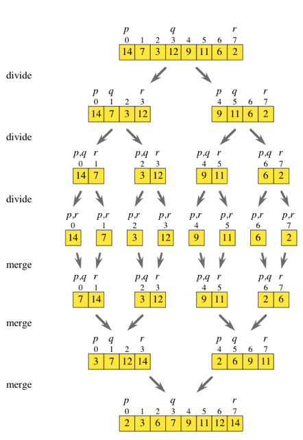
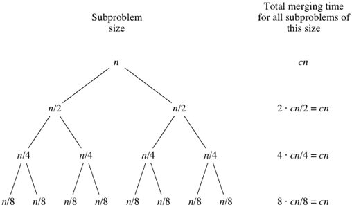
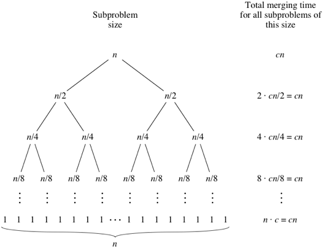

# Merge Sort
Split the list into two halves, recursively sort each half and then *merge* the two sorted sublists.

Subproblem -> sorting the *subarray* starting at index *p* through to index *r*.
* Subarray = `array[p..r]`

For an array of *n* elements the problem is to sort `array[0..n-1]`

Divide and Conquer:
1. **Divide** by finding the midway position *q* between *p* and *r*.
2. **Conquer** by recursively sorting the subarrays in each subproblem.
    * Sort `array[p..q]` and `array[q+1..r]`
3. **Combine** by merging the two sorted subarrays back into the single sorted subarray `array[p..r]`

**Base Case** = subarray with **< 2** elements
* When *p>=r*



```Javascript
let mergeSort = function(array, p, r) {
    if(p<r){
        let q = Math.floor((p+r)/2);
        mergeSort(array,p,q);
        mergeSort(array,q+1,r);
        mergeArray(); // Stub function
    }
};
```
## Merging
Given two sorted arrays *x[1...k]* and *y[1...l]*, the two can be merged into a single sorted array *z[1...k+l]*. The **first** element of *z* is the first element of either *x* or *y* - *x[0]*, *y[0]*. The rest of *z* can then be constructed recursively.

### Algorithm Outline
1. Compare the first **untaken** elements of each array.
    * untaken = not yet moved into result array.
2. Copy the smaller of the two into the result array.
3. Repeat until one array has had all of it's elements copied into the result array. Append all the remaining items from the other array to the result array.
    * Remaining items are already sorted and *must* be bigger than all those currently in the result.

### Pseudocode
```
function merge(x[0...k], y[0...l]){
    if k=0: return y[0...l]
    if l=0: return x[0...k]
    if x[0] <= y[0]:
        return x[0] concat merge(x[1...k], y[0...l])
    else:
      return x[0] concat merge(x[0...k], y[1...l])
}
```
**N.B**: 'concat' operator represents array concatenation.


## Iterative Implementation
Need to keep track of separate iterators for the two arrays as an item from only *one* array is added to the result each time.

Here, an array which **contains** two sorted subarrays in used as input. This is produced directly from the first part of the merge sort algorithm.

```Javascript
// Takes in an array that has two sorted subarrays,
//  from [p..q] and [q+1..r], and merges the array
let merge = function(array, p, q, r) {
    let lowHalf = [];
    let highHalf = [];

    let k = p;
    let i;
    let j;
    for (i = 0; k <= q; i++, k++) {
        lowHalf[i] = array[k];
    }
    for (j = 0; k <= r; j++, k++) {
        highHalf[j] = array[k];
    }
    
    k = p;
    i = 0;
    j = 0;
    
    // Repeatedly compare the lowest untaken element in
    //  lowHalf with the lowest untaken element in highHalf
    //  and copy the lower of the two back into array
    
    while(i< lowHalf.length && j < highHalf.length){
        if (lowHalf[i] <= highHalf[j]){
            array[k] = lowHalf[i];
            i++;
        }else{
            array[k] = highHalf[j];
            j++;
        }
        k++;
    }
    // Copy remaining elements from array which 
    // has not been fully copied
    while(i<lowHalf.length){
        array[k] = lowHalf[i];
        i++;
        k++;
    }
    
    while(j<highHalf.length){
        array[k] = highHalf[j];
        j++;
        k++;
    }
};
```
### Runtime Analysis - **&Theta;(n)**
 Merging requires a constant number of instructions *per element*:
1. Copy each element into `lowHalf` or `highHalf` 
2. Compare first untaken elements from `lowHalf` and `highHalf` and copy smallest of the two into `array` until all item taken from one of the subarrays.
3. Copy remaining items from subarray with items still untaken into `array`.

* In step 1 an element is copied into `array` *exactly one time*. 
* In step 2 each comparison takes constant time.
    * At most one element can 'win' the comparison **one** time.
* Each element is copied back into `array` *exactly one time* in steps **2 and 3** combined.

Each line of code is executed a constant number of time per element and `array` has *n* elements - therfore **&Theta;(n)**.

## Mergesort Analysis - **&Theta;(*n log n*)**
* **Divide** step is **&Theta;(1)**
    * Compute midpoint of array
* **Combine** step (merging) is  **&Theta;(n)**

The *divide* and *combine* steps **together** are **&Theta;(n)**. Therefore divide and combine steps take *cn* time for some constant *c*
* **&Theta;(1)** for divide is lower order *constant*

**Conquer** step -> recursive calls on an (*n/2*)-element subarray. Each recursive call takes *2 &middot; n/2<sup>x</sup>* where *x* is the 'level' of recursion:



As the subproblems get smaller, the *number* of subproblems double at each 'level' of recursion but the **merging time halves**. This cancels out leaving merging time of *cn* at each level of recursion.

The base case (subproblems of size 1) are **&Theta;(1)**.
* Test whether *p<r*

*n* elements = *n* base case subarrays. Total time for base cases is *n &middot; (1)* = *cn*:



Total time for mergesort is the **sum of the merging times for all levels** -> *num_levels &middot; cn*. Repeatedly halving *n* elements:
* *num_levels = log n+1* -> same as binary search.
* Total time = *cn(log n+1)*
* Discard constant term and low order coefficient = *&Theta;(n log n)*

**N.B:** As arrays are copied in the merge portion of mergesort, it **does not sort in place**.