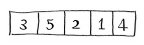
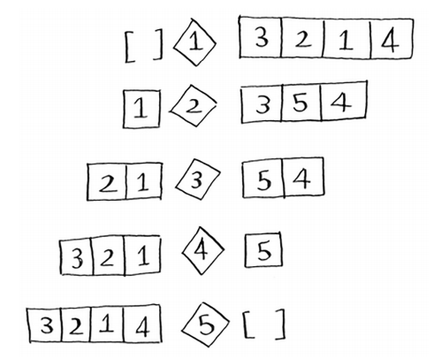
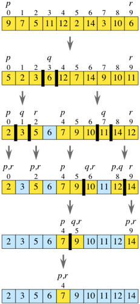
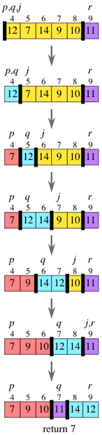
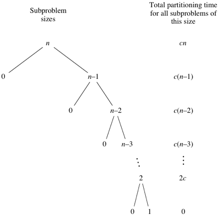
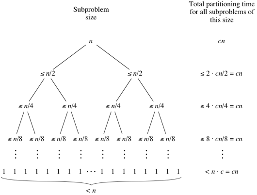

# Quicksort
Divide and conquer by repeatedly **partitioning** the array.

Using `array[p..r]`:
1. **Divide** -> **Partition** by choosing a **pivot** element (index *q*), rearrange `array` so elements <= *pivot* are to its left and elements > *pivot* are to its right.

2. **Conquer** -> Recursively sort subarrays `array[p..q-1]`(<=pivot) and `array[q+1..r]` (> pivot).
3. **Combine** -> *Nothing*, all elements after conquer step will already sorted. `[<= pivot] + pivot + [> pivot]`

**Base Cases**:
* Subarray with *< 2* elements
    * Already sorted
    * e.g. `[1]` or `[]`

Partitioning using different pivots:





Blue locations have been pivots in previous 'levels' of recursion -> won't be moved/looked at again:



## Implementation
* Recursively sort subarray `array[p..r]`
* If size subarray is 1 or 0 -> do nothing (base case)
* Divide and conquer to sort subarray:
    * Partition
    * Recursively sort partitioned subarrays
```Javascript
let quickSort = function(array, p, r) {
    if (p < r){
    let q = partition(array); // stub
    quickSort(array,p,q-1);
    quickSort(array,q+1,r);
    }
};
```

## Partitioning
For `array[p..r]`:
* Using rightmost element `array[r]` as pivot.
    * Could be other element.
* Iterate through array comparing each element to the pivot and rearranging:
    * *j* = iterator variable
    * *q* = final index of pivot
    * `array[p..q-1]` = elements *known* <= pivot
    * `array[q..j-1]` = elements *known* > pivot
    * `array[j..r-1]` = elements not compared yet (unkown relationship to pivot)
    * `array[r]` = pivot
* Returns index *q* of pivot so the `quicksort` function knows where the partitions are.

Partitioning `[12, 7, 14, 9, 10, 11] `



### Implementation
* Choose pivot (`array[r]`)
* Initialize *q* to *p*
    * Subarray might not start at 0
* Loop through array from *p* to *r*
    * Subarray might not start at 0
* Compare item to pivot
    * If <= pivot swap with `array[q]`
    * Increment *q*
* Swap `array[q]` and pivot (`array[r]`)
* Return final index of pivot *q*

```Javascript
let partition = function(array, p, r) {
    let q = p;
    for (let j=p;j<r;j++){
        if(array[j] <= array[r]){
            swap(array,j, q);
            q++;
        }
    }
    swap(array,q,r);
    return q;
};
```

### Merge Runtime Analysis - **&Theta;(n)**
*n* elements, each is compared with pivot, may or may not be swapped, *q* may or may not be incremented and *j* is always incremented. Code per element is constant, therefore partitioning is &Theta;(n): **linear-time** partitioning.

## Quicksort Analysis
There are **different** runtimes for quicksort, depending on the **pivot** chosen - partition balance.

### Worst Case
Partitions are as **unbalanced as possible** - each subproblem has an *empty* subarray. This makes the **call stack** very long.

Each call/level still takes &Theta;(n) or *cn* time, where *n* decreases for each call as the previous pivot is not included in the call -> *c(n-num_levels)*:



Total partitioning times gives arithmetic series:
```
cn+c(n−1)+c(n−2)+⋯+2c
= 2c(n+(n−1)+(n−2)+⋯+2)
​= c((n+1)(n/2)−1)
```
Ignoring low-order terms and constant coefficients gives **&Theta;(n<sup>2</sup>)** for the worst case.

### Best Case
Partions are **as evenly balances** as possible -> halving subproblem size each time -> shorter call stack.
* Sizes are equal or &plusmn; 1
* **Equal** if the subarray has an **odd** number of elements *and* the pivot is in the **middle** after partitioning -> so each partition has *(n-1)/2* elements.
* **&plusmn; 1** if subarray has an **even** number of elements and the **middle** pivot -> one partition has *n/2* elements, the other *n/2 -1*.

Partitions have **at most *n/2*** elements:



Run time is **sum of the merging times for all levels** like **mergesort** -> *num_levels &middot; cn*. Repeatedly halving *n* elements:
* *num_levels = log n+1* -> same as binary search.
* Total time = *cn(log n+1)*
* Discard constant term and low order coefficient to get Big-&Theta;

Best case = = **&Theta;(n log n)**

### Average Case - **O(n log n)**
With input in random order, and a pivot chosen at random.