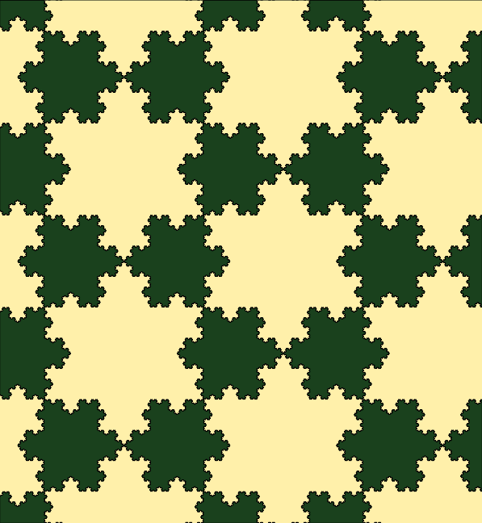

# Koch Curve/Snowflake


## Construction
Each line segment of an equilateral triangle is recursively altered:
1. Divide the line segment into **three** euql length segments.
2. Draw an equilateral triangle that has the **middle segment** from step 1 as its base, pointing outward.
3. Remove the line segment that is the base of the triangle from step 2.

## Thue-Morse Sequence
Binary sequence obtained by starting with 0 and successively appending the **boolean compliment** of the sequence obtained so far.

Sequence begins:
```
01101001100101101001011001101001...
```

Defined **recursively** using *bitwise negation*. Each sequence is the bitwise negation of the sequence before it.

*2<sup>n+1<sup>* elements = bitwise negation of *2<sup>n</sup> elements*
* *s=0*
* bitwise negation of 0 = 1
* *s=01* -> first 2 (2<sup>1</sup>) elements
* bitwise negation of 01 = 10
* *s=0110* -> first 4 (*2<sup>2</sup>) elements
* bitwise negation of 0110 = 1001
* *s=01101001* -> first 8 (*2<sup>3</sup>*) elements
* Repeat

## Using a Thue-Morse sequence for Koch Curve
* Loop through the sequence:
    * *t(n)=0* -> move ahead one unit
    * *t(n)=1* -> rotate counterclockwise by &pi;/3 radians (60&deg;)

## `drawCurve` Method
* Inputs:
    * Thue-Morse sequence
    * x -> start x coord
    * y -> start y coord
* Outputs:
    * Draws Koch Snowflake
```Javascript
function drawSnowflake(t){
    for(let i=0;i < t.length;i++){
        if (i==0){
            drawLine()
        }else{
            rotate(60) -> counter clockwise
        }
    }
}
```

## `drawLine` Method
* Inputs:
    * x1 = Starting x coord
    * y1 = Starting y coord
    * length = Length of line
    * angle = angle to draw line
* Calculate end point of line:
    * (x1, y1) + **vector of line**
    * vector = *(length &middot; Cos(angle), length &middot; Sin(angle))*
    * Add vector components to (x1,y1) to get (x2,y2)
* Drawline from (x1,y1) -> (x2,y2)