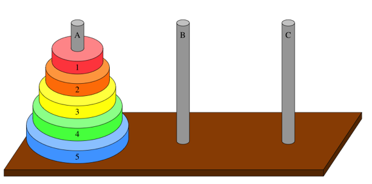
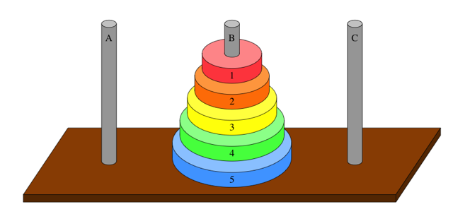

# Towers of Hanoi
Given a set of three pegs and *n* disks (each of different size). The disks must be moved to the middle peg using 3 rules:
1. Only move one disk at a time
2. Each move consists of tking the **upper** disk from a stack and moving it on top of another.
3. No disk may be placed on top of a smaller disk.

At the start:

Goal: 

## Recursive Solution
* Base case *n=1*:
    * Just move disk 1
* Recursive case *n >= 2*:
    * Recursively solve the subproblem of moving disks 1 -> *n-1* from whichever peg they start on to the spare peg.
    * Move disk *n* from the peg it starts on to the peg it's supposed to end up on.
    * Recursively solve the subproblem of moving disks 1 -> *n-1* from the spare peg to the peg they're supposed to end up on.

Solving for *n* disks requires **2n-1** moves:
* *2n-1-1* to recursively solve first subproblem of moving disks 1 -> *n-1*
* 1 move to move disk *n*
* *2n-1-1* moves to recursively solve the second subproblem of moving disks 1 -> *n-1*