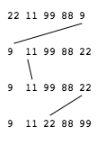

# Project: Selection Sort Visualizer
Create a visualization of the steps in a selection sort using **ProcessingJS**.



The finished solution should show 4 different arrays in separate quadrants of the canvas: 
* Normal array
* Reverse sorted values
* Multiple values the same
* Only one value out of order

## Planning
* Display array items using `text(text, x, y)`
    * Set size for each item
    * Set canvas positions using their `index + offset` of set size
* In selection sort:
    * create new y location each iteration
        * `y_start + array_height*i` 
    * pass current minimum index and current index in array to display function.
    * Draw line from one to the other
        * `x1=min_index*item_width`
        * `y1=current_y - array_height`
        * `x2=current_index*item_width`
        * `y2=current_y`
### `displayArray` Function
* Loop through input array
* Draw each item on canvas as text
    * Change colour if item to be swapped
* Draw line showing swap
* Inputs:
    * array
    * y coord to draw array at
    * index of minimum item
    * current index of selection sort
```Javascript
let displayArray = function (array, y, minIndex, currentIndex) {
    textFont(createFont("monospace"), 12);
    for (let i = 0; i < array.length; i++) {
        if (i === minIndex) {
            fill(0, 26, 255); // Blue shows item to be swapped
        } else {
            fill(0, 0, 0);
        }
        text(array[i], xStart + (itemWidth * i), y);
    }
    if (currentIndex >= 0) {
        // Default browser line-height = 1.2, multiply by font-size
        // to get coord of top of character
        line(xStart + (minIndex + 0.25) * itemWidth, y + (fontSize * 1.2 / 4),
            xStart + (currentIndex + 0.25) * itemWidth, y + arrayHeight - (fontSize * 1.2));
    }
};
```
### Modified `selectionSort` Function
* On each iteration call `displayArray` with current *y* value, index of minimum item to be swapped, current index in loop.
* Increase *y* for displaying next iteration
    * `y += arrayHeight`
```Javascript
let selectionSort = function (array) {
    let minIndex;
    let y = yStart;
    for (let i = 0; i < array.length; i++) {
        minIndex = indexOfMinimum(array, i);
        displayArray(array, y, minIndex, i);
        y += arrayHeight;
        swap(array, i, minIndex);
    }
    displayArray(array, y, -1, -1);
};
```
